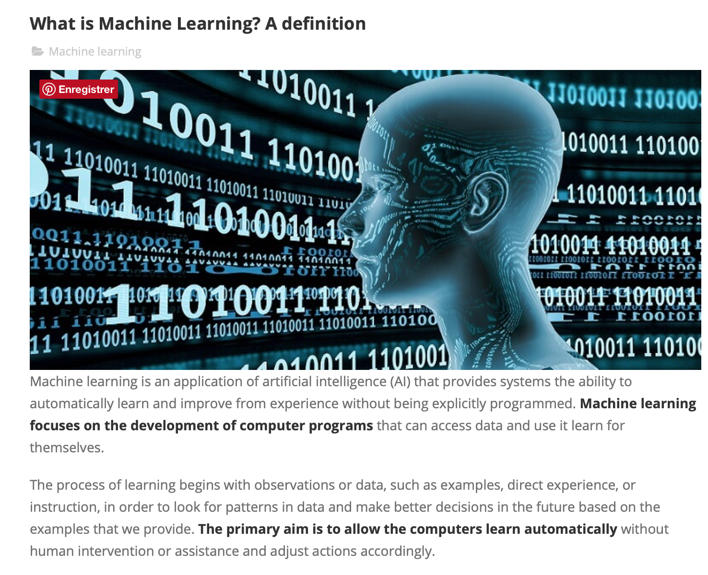
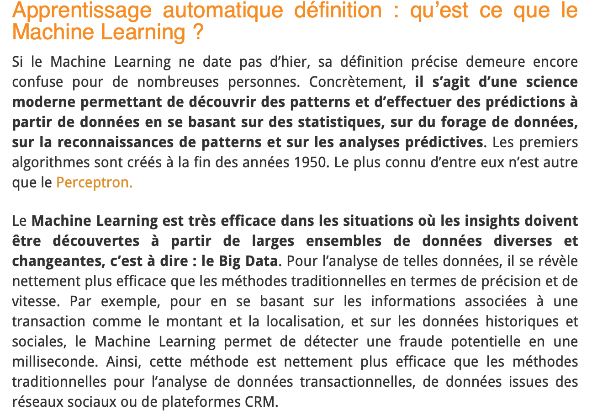

# Définitions

Cette classe comporte les références de sites avec des définitions claires et concises du Machine Learning.

**EXPERTSYSTEM. What is Machine Learning? A definition - Expert System [en ligne]. 7 mars 2017. [Consulté le 7 juin 2019]. Disponible à l’adresse : https://www.expertsystem.com/machine-learning-definition/**

**INPRINCIPIO. Definition : Machine learning et Intelligence Artificielle. Dans : L’intelligence Artificielle [en ligne]. [s. d.]. [Consulté le 8 juin 2019]. Disponible à l’adresse : https://www.inprincipio.xyz/machine-learning/**

**L, +Bastien. Machine Learning et Big Data : définition et explications. Dans : LeBigData.fr [en ligne]. 6 juillet 2018. [Consulté le 7 juin 2019]. Disponible à l’adresse : https://www.lebigdata.fr/machine-learning-et-big-data**

