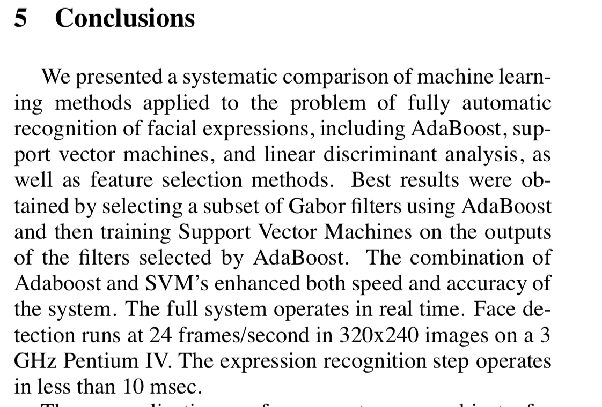
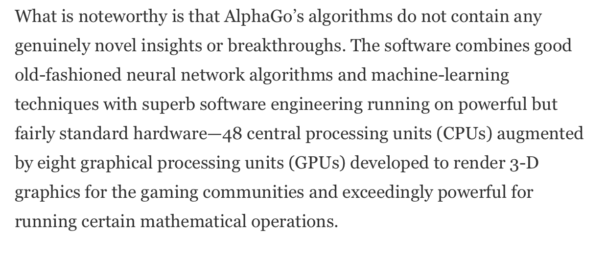
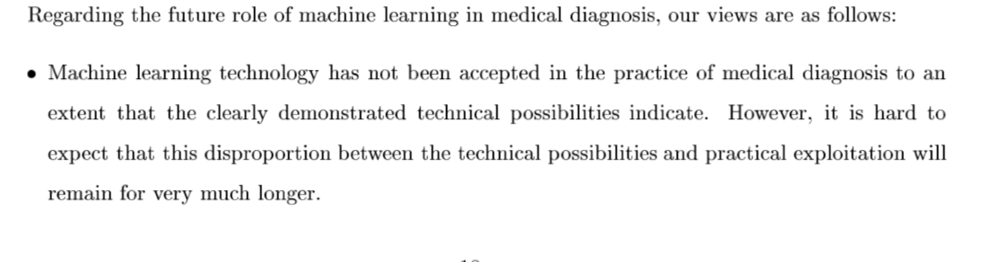
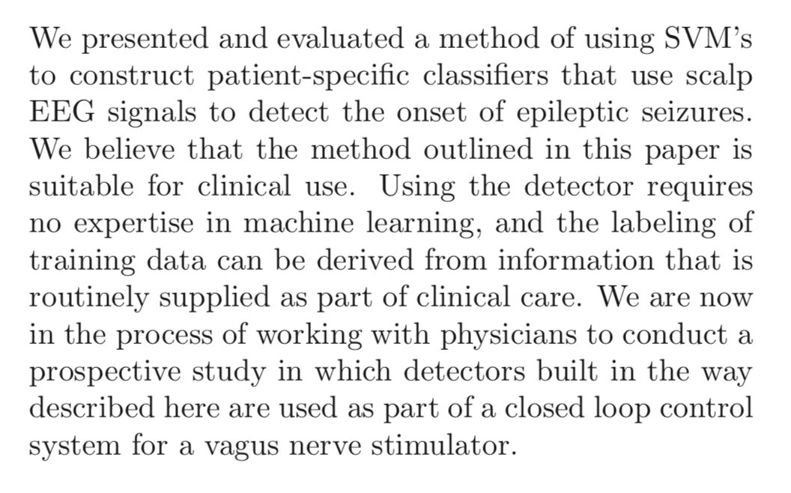
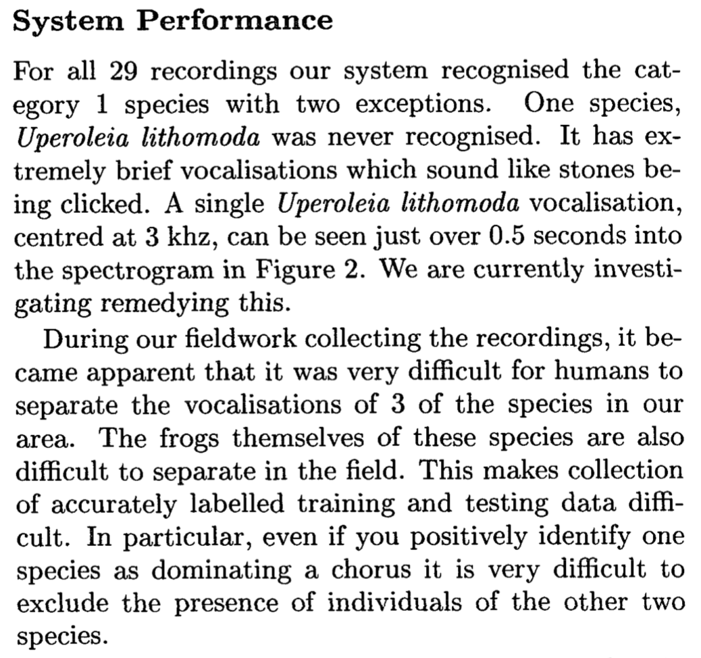
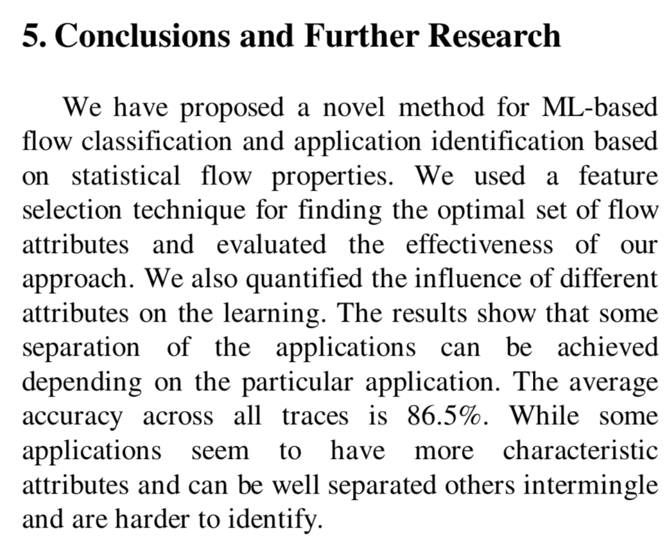

# Applications

Cette classe contient les références de différentes apllications possibles du Machine Learning.

**BARTLETT, M. S., LITTLEWORT, G., FRANK, M., LAINSCSEK, C., FASEL, I. et MOVELLAN, J. Recognizing facial expression: machine learning and application to spontaneous behavior. Dans : 2005 IEEE Computer Society Conference on Computer Vision and Pattern Recognition (CVPR’05). Vol. 2 [en ligne]. juin 2005, p. 568‑573 vol. 2. DOI 10.1109/CVPR.2005.297**

**KOCH, Christof. How the Computer Beat the Go Master. Dans : Scientific American [en ligne]. [s. d.]. [Consulté le 20 mai 2019]. Disponible à l’adresse : https://www.scientificamerican.com/article/how-the-computer-beat-the-go-master/**

**KONONENKO, Igor, KUKAR, Matjaz et BRATKO, Ivan. Application of Machine Learning to Medical Diagnosis [en ligne]. [S. l.] : University of Ljubljana, [s. d.]. [Consulté le 20 mai 2019]. Disponible à l’adresse : http://lkm.fri.uni-lj.si/xaigor/slo/clanki/michal97.ps**

**SHOEB, Ali et GUTTAG, John. Application of Machine Learning To Epileptic Seizure Detection. [s. d.], p. 8**

**TAYLOR, Andrew, WATSON, Graeme, GRIGG, Gordon et MCCALLUM, Hamish. Monitoring Frog Communities : An application of Machine Learning. Case Studies. [S. l.] : [s. n.], [s.d.]**

**ZANDER, S., NGUYEN, T. et ARMITAGE, G. Automated traffic classification and application identification using machine learning. Dans : The IEEE Conference on Local Computer Networks 30th Anniversary (LCN’05)l [en ligne]. novembre 2005, p. 250‑257. DOI 10.1109/LCN.2005.35**

