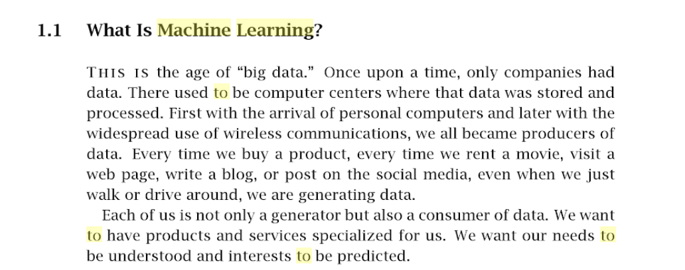
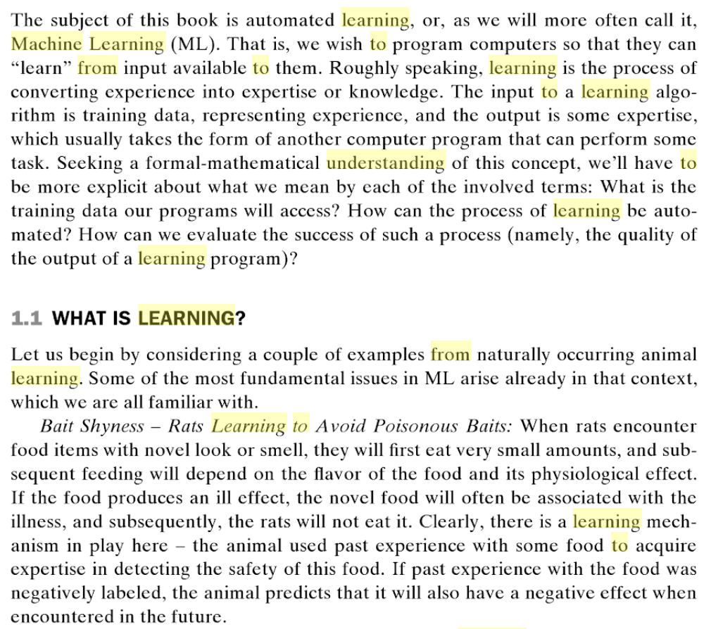
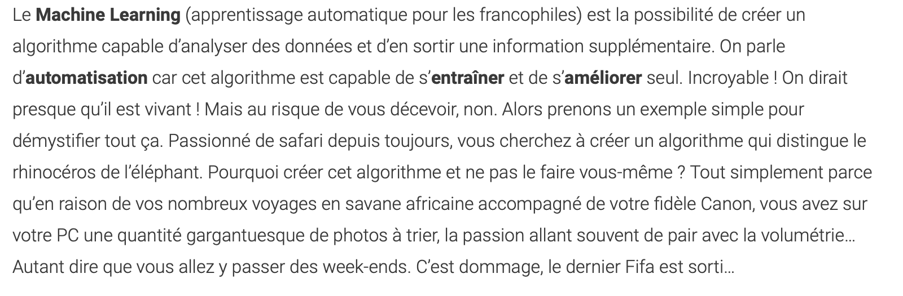
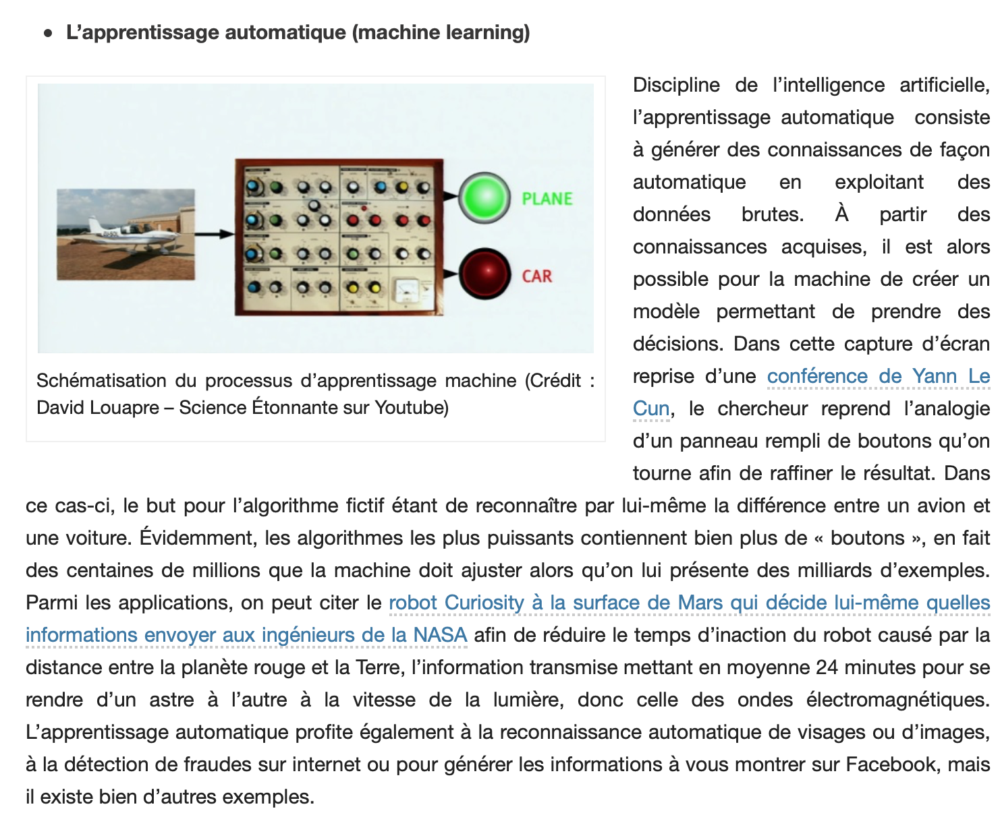

# Explications

Cette classe comporte les références d'articles avec des explications complètes sur le Machine Learning.

**ALPAYDIN, Ethem. Introduction to Machine Learning. [S. l.] : MIT Press, 4 décembre 2009. ISBN 978-0-262-30326-2. Google-Books-ID: TtrxCwAAQBAJ**

**MAINI, Vishal. A Beginner’s Guide to AI/ML 🤖👶. Dans : Machine Learning for Humans [en ligne]. 19 août 2017. [Consulté le 15 mai 2019]. Disponible à l’adresse : https://medium.com/machine-learning-for-humans/why-machine-learning-matters-6164faf1df12**

**OXFORDSPARKS. What is Machine Learning? [en ligne]. [s. d.]. [Consulté le 7 juin 2019]. Disponible à l’adresse : https://www.youtube.com/watch?v=f_uwKZIAeM0**

**SHALEV-SHWARTZ, Shai et BEN-DAVID, Shai. Understanding Machine Learning: From Theory to Algorithms. [S. l.] : Cambridge University Press, 19 mai 2014. ISBN 978-1-139-95274-3. Google-Books-ID: Hf6QAwAAQBAJ**

**SOULEIMAN, Ibrahim. Introduction et vulgarisation. Dans : Meritis [en ligne]. octobre 2018. [Consulté le 2 mai 2019]. Disponible à l’adresse : https://meritis.fr/ia/introduction-et-vulgarisation/**

**Intelligence artificielle: histoire et notions de base (partie 1 de 2). Dans : Hinnovic [en ligne]. 13 mars 2018. [Consulté le 8 juin 2019]. Disponible à l’adresse : http://www.hinnovic.org/histoire-et-notions-de-base-en-intelligence-artificielle/**

