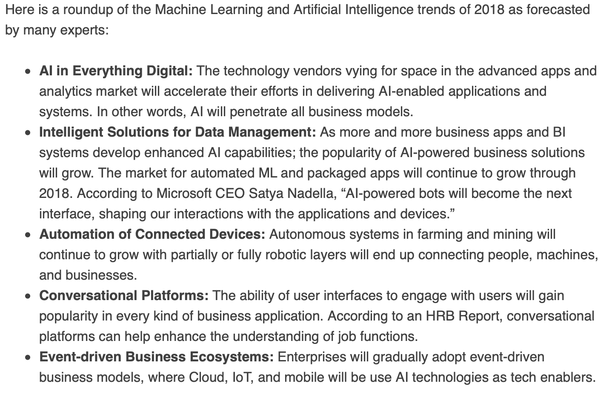
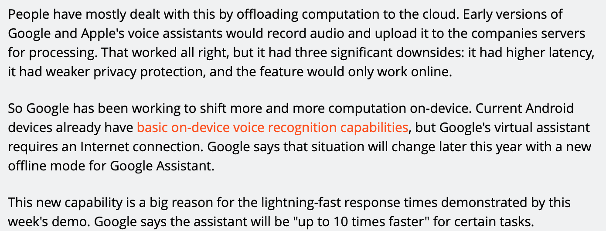
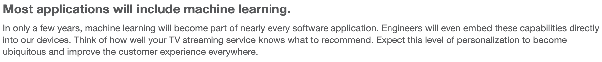
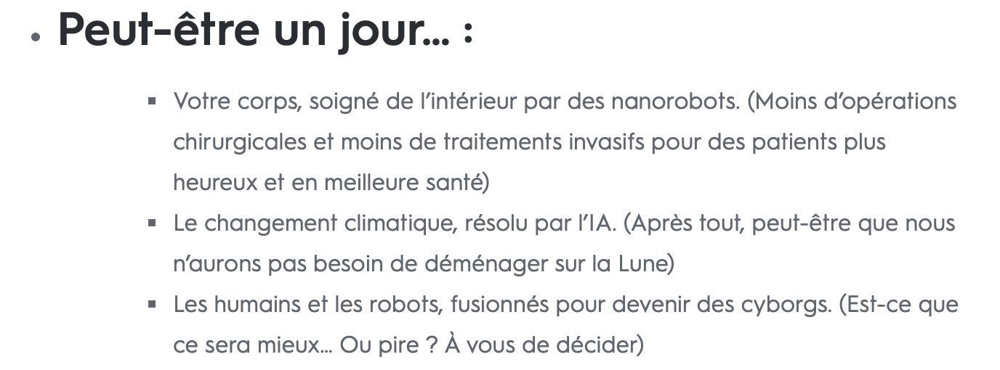

# Futur du Machine Learning

**GHOSH, Paramita. Machine Learning and Artificial Intelligence Trends in 2018. Dans : DATAVERSITY [en ligne]. 6 février 2018. [Consulté le 7 juin 2019]. Disponible à l’adresse : https://www.dataversity.net/machine-learning-artificial-intelligence-trends-2018/**

**LEE, Timothy B. Why Google believes machine learning is its future. Dans : Ars Technica [en ligne]. 10 mai 2019. [Consulté le 8 juin 2019]. Disponible à l’adresse : https://arstechnica.com/gadgets/2019/05/googles-machine-learning-strategy-hardware-software-and-lots-of-data/**

**5 predictions for the future of machine learning. Dans : IBM Big Data & Analytics Hub [en ligne]. [s. d.]. [Consulté le 8 juin 2019]. Disponible à l’adresse : https://www.ibmbigdatahub.com/blog/5-predictions-future-machine-learning**

**Le futur du Machine Learning : Chronologie. Dans : FR - Criteo.com [en ligne]. 5 février 2018. [Consulté le 8 juin 2019]. Disponible à l’adresse : https://www.criteo.com/fr/insights/le-futur-du-machine-learning-chronologie/**

