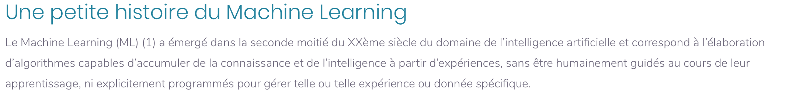
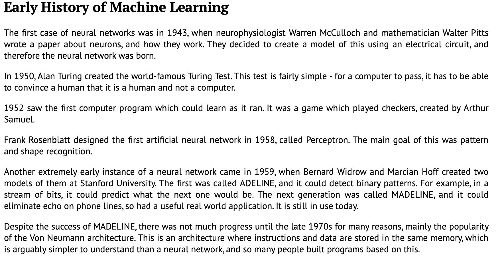
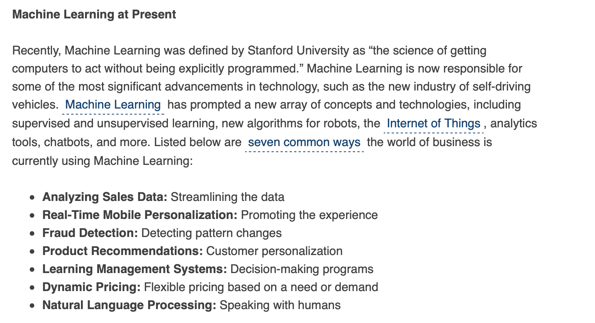
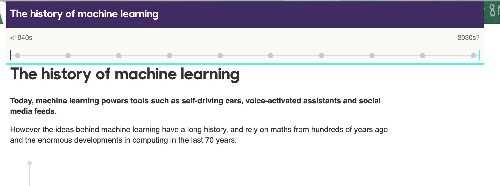

# Histoire du Machine Learning

Cette classe contient les références retraçant l'histoire du Machine learning.

**FOOTE, Keith D. A Brief History of Machine Learning. Dans : DATAVERSITY [en ligne]. 26 mars 2019. [Consulté le 8 juin 2019]. Disponible à l’adresse : https://www.dataversity.net/a-brief-history-of-machine-learning/**

**MAYO, Hugo. History of Machine Learning [en ligne]. 2018. [Consulté le 8 juin 2019]. Disponible à l’adresse : https://www.doc.ic.ac.uk/~jce317/history-machine-learning.html**

**PIONEERS, Building AI with. Une petite histoire du Machine Learning. Dans : Quantmetry [en ligne]. 28 octobre 2015. [Consulté le 8 juin 2019]. Disponible à l’adresse : https://www.quantmetry.com/une-petite-histoire-du-machine-learning/**

**The history of machine learning. Dans : BBC Academy [en ligne]. [s. d.]. [Consulté le 28 mai 2019]. Disponible à l’adresse : http://www.bbc.co.uk/timelines/zypd97h**

